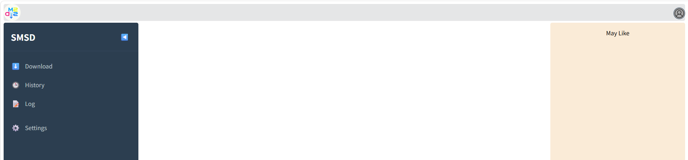

[TOC]

# 📝 项目功能\(Function\)

本项目是一个社交媒体音视频流下载器，目前提供：

- [x] 抖音直播下载
- [x] 抖音单作品下载（视频 / 图集 / 原声 / 封面）
- [x] 下载历史筛选 + 直播状态检查

# 💻 程序界面\(Screenshot\)



# 📽 运行演示\(Example\)

## 方式一：直接下载演示

1. 下载本项目后，进入项目根目录
```shell
# 示例
[userid@localhost SocialMediaStreamDownloader]$ pwd
~/SocialMediaStreamDownloader
```

2. 创建唯一运行时配置并填写实际值

```shell
mkdir -p config
cp docs/design/config.yml.example config/config.yml
chmod 600 config/config.yml
```

`config/config.yml` 是唯一持久配置源；不要提交该文件，也不要另建 `.env`
保存数据库、端口、Cookie 或 Token。

`download.test_mode: true` 只跳过最终的直播流数据传输。分享链接解析、直播信息请求、
状态判断、流地址提取、数据库读写、目录准备和任务调度与正常模式保持一致，因此测试模式
仍会访问网络和数据库，也不能作为离线或沙箱模式使用。

直播流始终优先选择 FLV；所有 FLV 清晰度均无可用地址时，才按 `hls_clarity` 自动回退
HLS，并通过 ffmpeg stream-copy 保存为 `.ts` 文件。Docker 镜像已经安装 ffmpeg；直接在
宿主机运行时必须保证 `ffmpeg` 可执行文件位于 `PATH`。测试模式不会启动 ffmpeg，因此
不要求宿主机安装该程序。

HLS 的短暂网络中断由 ffmpeg 有界重连处理：`max_timeout` 限制单次网络 I/O 等待，
`hls_stall_timeout` 限制无输出进展时长，`hls_terminate_grace` 是 TERM 后的退出宽限，
`max_retry` 是首次尝试后的进程重启次数。健康直播没有总录制时长限制；这些参数统一在
YAML 中配置。

3. 执行运行脚本将自动安装依赖并部署
```shell
# 需要提前安装 python3.12，此处不做介绍
[SocialMediaStreamDownloader]$ sh ./run-server.sh
```

4. 使用 `config/config.yml` 中的 `server.port` 打开网页，在输入框添加分享链接即可下载


## 单作品下载

**用法与直播完全相同** —— 同一个输入框，粘贴作品分享链接即可，不需要选类型。后端跟随
分享链接的跳转，按落地地址分流：直播间走直播链路，`/video/`、`/note/`、
`/share/video/`、`discover?modal_id=` 走作品链路。识别不出来的链接会记一条 warning 后丢弃。

一个作品会取回**四类文件**（各自可在 `platform.douyin.aweme.media` 下单独关闭）：
无水印视频、图集各图、原声、封面。

**存放结构：每个作品一个目录。**

```
{download.save_path}/douyin/aweme/{主播目录}/{发布时间}_{aweme_id}/
    20260701081200_7657271784144009946.mp4
    20260701081200_7657271784144009946_music.mp3
    20260701081200_7657271784144009946_cover.jpg
```

一个视频作品本身就产出 3 个文件，平铺会把多个作品的碎片混在一起，所以按作品归档。

**文件名不含作品文案**：文案可被作者修改、长度无上限，放进文件名会让「已下载」判定失效。
文案保存在 `aweme_record.desc`。

**不会重复下载。** 唯一性由五层保证：文件名里的 `aweme_id` 按 `_` 边界匹配；每类文件有
稳定尾（`.mp4` / `_music.mp3` / `_cover.jpg` / `_NN.jpg`）；主播改名时沿用数据库里记录的
原目录；不同账号同昵称时目录追加 `owner_user_id`（抖音不要求昵称唯一）；同一作品并发提交时
串行处理。判定**以磁盘上的文件为准**，因此数据库关闭、记录被删、平台某次响应少给一个文件，
都不会导致重复下载或永久漏文件。

作品之间的并发由 `platform.douyin.aweme.concurrency` 控制（默认 3），使用独立线程池 ——
不与直播下载、不与直播状态探测共享，避免相互阻塞。同一作品内的多个文件串行下载。

无登录时抖音的签名接口可用性不可控，因此 `POST_DETAIL` 失败后会回落解析分享页内嵌的
JSON（`platform.douyin.aweme.html_fallback`，默认开启）。作品已删除、设为私密或仅粉丝可见
属于正常结果，只记 info 日志，不重试、不写库。

## 下载历史筛选与直播状态检查

Download 与 History 两个页面共用同一个历史主播列表（Download 页是精简版）。
筛选和判定是分开的两件事：

1. **筛选**只读数据库，不发任何平台请求。可按昵称、收藏与评分区间、用户状态、
   「上次见到在播」时间窗筛选，并按评分 / 下载次数 / 上次见到在播排序。
   升序即「下载次数最少」与「最久未下载」。每页上限由 `history.page_size_limit` 控制。
2. **判定**只来自点击「检查直播状态」后发出的真实请求，且只针对当前这一页。
   一次探测约 5-12 秒，因此并发与批量都受 `platform.douyin.live.probe` 约束。
   探测到正在直播的行会出现「立即下载」，走既有的下载入口。

`share_url` 上的 `last_live_status` / `last_checked_at` / `last_room_id` 是探测结果的
缓存，用来支撑筛选排序和「上次见到：3 天前」这类提示，**不代表此刻是否在播**。
数据库关闭或不可用时，历史列表返回 503 并在界面上说明，直播下载本身不受影响。

## 数据库结构迁移

数据库启用时，先显式确认 schema 状态；服务启动不会自动建表或执行迁移：

```shell
python -m backend.src.database.migration_cli status
python -m backend.src.database.migration_cli check
```

新数据库使用：

```shell
python -m backend.src.database.migration_cli upgrade
```

已有数据库必须先通过 `check`，备份并人工复核后，才可纳入当前基线：

```shell
python -m backend.src.database.migration_cli stamp
```

其余显式命令为：

```shell
python -m backend.src.database.migration_cli downgrade REVISION --confirm-database DATABASE_NAME
python -m backend.src.database.migration_cli revision "change description"
```

`stamp` 只写 Alembic 版本，不执行建表或 `ALTER`。不带参数时它记录当前 head，且只有
全部受管表的严格结构校验通过时才会执行——因此记录下来的版本不可能说谎。

如果已有数据库停留在更早的版本（例如它匹配基线，但仓库里已经有了后续迁移），
`check` 会列出缺失的列而拒绝 `stamp`。这时用显式版本把它纳入对应的那一版，
再正常 `upgrade` 补齐后续迁移：

```shell
python -m backend.src.database.migration_cli stamp \
  --revision 0001_initial_schema --confirm-database DATABASE_NAME
python -m backend.src.database.migration_cli upgrade
```

指定非 head 版本时无法用当前 ORM 元数据校验，因此它是一次显式的人工判断，
必须像 `downgrade` 一样回填真实库名确认。执行前请务必备份。

`upgrade` 会拒绝含受管表但尚未版本化的数据库，已有库必须先走 `check + stamp`。非临时库执行 `downgrade` 必须用实际库名进行显式确认；基线
revision 的任何降级路径（包括 `base`、`-1` 等等价写法）只允许通过显式数据库名 override
创建且严格命名的临时迁移测试库。所有降级操作前必须备份并人工审查 revision。
运行时状态为 `ready` 时才允许持久化写入；`unavailable` 或 `blocked` 不阻断 live 网络请求
和流下载，但会跳过数据库写入。

### 升级到作品下载版本（`0003_aweme_record`）

本次新增受管表 `aweme_record`，受管表从 12 张变为 13 张，head 为 `0003_aweme_record`。
**升级顺序必须是先补配置、再发代码、最后跑迁移**，理由见下。

**第 1 步：补配置**（不做这一步服务起不来）

`config/config.yml` 需要新增 `platform.douyin.aweme` 配置块，内容照 `docs/design/config.yml.example`
抄。配置契约要求 example 里的每个键都在实际配置中存在，缺键会让服务在启动时直接失败，
而不是降级运行。**每个实例各有一份配置，都要补**。

**第 2 步：确认数据库当前状态**（只读，不改任何东西）

```shell
python -m backend.src.database.migration_cli status
python -m backend.src.database.migration_cli check
```

按 `status` 的输出选择第 3 步：

| `status` 输出 | 含义 | 做法 |
|---|---|---|
| `state=ready current=0002_...` | 已版本化且在上一版 | 直接 `upgrade`（情形 A） |
| `state=ready current=0003_aweme_record` | 已经是最新 | 无需操作 |
| `state=unversioned` | 有受管表但没有 Alembic 版本记录 | 先纳入基线再升（情形 B） |
| 空库 | 全新数据库 | 直接 `upgrade`（情形 A） |

**情形 A：直接升级**

```shell
python -m backend.src.database.migration_cli upgrade
```

**情形 B：未版本化的已有数据库**

`upgrade` 会拒绝这种库。先备份，再用显式版本纳入它实际所处的那一版，然后正常 `upgrade`
补齐后续迁移：

```shell
# 0. 先备份
mysqldump -u USER -p DATABASE_NAME > DATABASE_NAME-backup-$(date +%F).sql

# 1. 纳入基线。check 若报缺少 0002 的列（last_live_status /
#    last_checked_at / last_room_id），说明这个库停在 0001，用显式版本纳入
python -m backend.src.database.migration_cli stamp \
  --revision 0001_initial_schema --confirm-database DATABASE_NAME

# 2. 补齐 0002 与 0003
python -m backend.src.database.migration_cli upgrade
```

`0002` 含一次 backfill；其 docstring 记录了原始 JOIN 写法在 7,538 行 `share_url` ×
29,679 行 `room_base` 上耗时 17.9 分钟，改为 Python 侧聚合后降到数秒。`0003` 是纯建表，
无 backfill。

**第 3 步：确认结果**

```shell
python -m backend.src.database.migration_cli status   # 期望 state=ready current=0003_aweme_record
python -m backend.src.database.migration_cli check    # 期望 managed schema is compatible
```

**回滚**

```shell
python -m backend.src.database.migration_cli downgrade \
  0002_share_url_live_status_cache --confirm-database DATABASE_NAME
```

`0003` 的 downgrade 会删除 `aweme_record` 整张表及其两个索引，作品下载记录随之丢失
（磁盘上的文件不受影响）。执行前必须备份。

**不升级会怎样**：作品下载的文件照样下载，但 schema guard 判定为 `blocked`，
所有数据库写入被跳过 —— `aweme_record` 不会有记录，History 页也会返回 503。
去重不依赖数据库（以磁盘上的文件为准），因此重复提交同一链接仍然不会重复下载。

## 方式二：Docker Compose

完成同一份 `config/config.yml` 后，通过包装脚本启动：

```shell
./run-docker.sh up -d
```

脚本仅在本次 Compose 命令期间派生权限为 `0600` 的临时插值文件，并在退出时删除；
应用容器将 `config/config.yml` 只读挂载到 `/run/secrets/`，入口以 root 校验并复制到
容器可写层的 canonical 路径，设置 `appuser` 所有权和 `0600` 后立即降权运行服务。
容器内连接配套 MySQL 时，将
`database.host` 配置为 `mysql`。

# 🔐 安全配置\(Security Configuration\)
本项目使用本地且被 Git/Docker 构建上下文排除的 `config/config.yml` 管理敏感配置。

## 安全要求

- 保持 `config/config.yml` 权限最小化，并定期轮换数据库密码、Cookie 和 Token。
- 不要将真实配置复制进镜像、日志、Issue 或测试 fixture。
- Alembic 配置不保存数据库 URL；迁移命令只从统一 YAML 在内存中构造连接。
- 仓库历史中曾暴露的凭据需要在外部完成轮换；本项目不会自动重写 Git 历史。

# ⚠️ 免责声明\(Disclaimers\)

## **项目性质说明**
**SocialMediaStreamDownloader**（下称“本项目”）是一个**技术研究项目**，旨在探讨多媒体内容获取与处理的技术实现。本项目提供的所有代码、文档及相关资源**仅供学习、研究与合法合规用途参考**。

## **使用责任与法律风险**
- **用户责任**：您在使用本项目时，应自行了解并遵守所在国家/地区关于数据获取、版权保护、隐私保护等相关法律法规。**因使用本项目所产生的任何法律风险及后果，由用户自行承担**。    
- **内容限制**：禁止使用本项目下载、传播或用于以下内容：    
    - 受版权保护且未经授权的内容        
    - 侵犯他人隐私或肖像权的内容        
    - 违反平台服务条款的内容        
    - 任何违法、违规或破坏性用途        
- **平台规则**：使用本项目时，请严格遵守相关社交媒体平台（如 YouTube、Twitter、Instagram 等）的**服务条款**（Terms of Service）。违规使用可能导致您的账户被封禁或法律追责。

## **技术免责**
- **稳定性**：本项目不保证在所有平台、网络环境或系统配置下的稳定性和兼容性。    
- **维护**：开发者不承担因代码更新、API变更或第三方服务调整导致的故障修复义务。    
- **数据安全**：使用本项目时，请自行注意数据安全与隐私保护，开发者不对数据泄露或损失负责。 

## **版权声明**
- 本项目代码采用开源许可证（详见 `LICENSE` 文件）。    
- 项目中涉及的第三方库、API或平台商标归其所有者所有。    
- **本项目不授予任何使用其代码侵犯第三方权利的许可**。   

## **免责范围**
**开发者及贡献者不对以下情况承担责任**：
- 用户违反法律法规或平台条款的行为    
- 因使用本项目造成的直接或间接损失    
- 项目代码被用于任何非法或侵权活动    
- 因技术问题导致的数据丢失、系统故障或其他风险   

## **使用即表示同意**
**当您使用、复制或修改本项目代码时，即表示您已阅读、理解并同意本免责声明的全部内容。如您不同意，请立即停止使用本项目。**

⚠️  注意：请仅在遵守相关法律法规及平台条款的前提下使用本工具。
    开发者不对滥用行为负责，使用前请务必了解当地法律及平台政策。

# ✉️ 联系作者\(Contact\)

- 本项目的 Github 仓库链接 [SocialMediaStreamDownloader](https://github.com/WangYan-Good/SocialMediaStreamDownloader.git)

针对本项目有任何问题请在公开仓库中提交 [issue](https://github.com/WangYan-Good/SocialMediaStreamDownloader/issues) 或参与讨论。

# ♥️ 支持项目\(Support\)


# 📜 变更记录\(Change\)

参考 [变更记录](./docs/history-ZH.md#-日志记录)

# 💡 项目参考\(Refer\)

* https://github.com/Johnserf-Seed/f2
* https://github.com/Johnserf-Seed/TikTokDownload
* https://github.com/ihmily/DouyinLiveRecorder
* https://github.com/JoeanAmier/TikTokDownloader

# 📄 开源许可\(License\)

本项目采用 **GNU Affero General Public License v3.0 (AGPL-3.0)** 开源协议。

**重要提示**：
- 本工具仅供**合法学习与研究**使用
- 使用前请确保遵守相关法律法规及平台条款
- 开发者对任何滥用行为不承担责任
