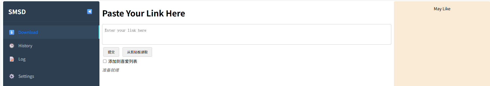

[TOC]

# 📝 项目功能\(Function\)

# 💻 程序界面\(Screenshot\)

TODO

# 📽 运行演示\(Example\)

## 直接下载演示

1. 下载本项目后，进入项目根目录
```shell
# 示例
[userid@localhost SocialMediaStreamDownloader]$ pwd
/mnt/nvme/CodeSpace/OpenSource/SocialMediaStreamDownloader
```
2. 执行前请确认已经下载安装 python3.11 或之后的版本
```shell
[userid@localhost SocialMediaStreamDownloader]$ python3 --version
Python 3.11.8
```
3. 创建虚拟环境 venv 并激活
```shell
[userid@localhost SocialMediaStreamDownloader]$ python3 -m venv venv

[userid@localhost SocialMediaStreamDownloader]$ . ./venv/bin/activate
(venv) [userid@localhost SocialMediaStreamDownloader]$
```

4. 执行脚本安装依赖
```shell
(venv) [userid@localhost SocialMediaStreamDownloader]$ sh run-server.sh # 等待执行完成即可
你处于Python虚拟环境中，路径为：/mnt/nvme/CodeSpace/OpenSource/SocialMediaStreamDownloader/venv
当前pip3的版本是：24.2
当前pip3版本不是最新，正在更新...
Looking in indexes: https://pypi.tuna.tsinghua.edu.cn/simple/
Requirement already satisfied: pip in ./venv/lib/python3.11/site-packages (24.2)
pip3 更新完成，新版本为：
Looking in indexes: https://pypi.tuna.tsinghua.edu.cn/simple/
...
```

5. 启动 web 服务
```shell
(venv) [userid@localhost SocialMediaStreamDownloader]$ python3 ./server.py
```

6. 打开浏览器，输入框添加分享链接


# 📋 项目说明\(Instructions\)

TODO

# ⚠️ 免责声明\(Disclaimers\)

TODO

# ✉️ 联系作者\(Contact\)

TODO

# ♥️ 支持项目\(Support\)

TODO

# 📜 变更记录\(Change\)

参考 [变更记录](./docs/history-ZH.md#-日志记录)

# 💡 项目参考\(Refer\)

* https://github.com/Johnserf-Seed/f2
* https://github.com/Johnserf-Seed/TikTokDownload
* https://github.com/ihmily/DouyinLiveRecorder
* https://github.com/JoeanAmier/TikTokDownloader