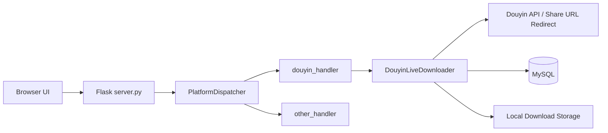

# 系统设计文档

## 1. 设计目标

SocialMediaStreamDownloader（SMSD）用于处理社交媒体分享链接，完成平台识别、数据抓取、直播流下载和数据落库。

当前实现重点：

- Web 入口接收批量链接请求
- 平台分发与异步任务执行
- 抖音直播链路下载
- MySQL 持久化（连接池）
- 本地部署与 Docker Compose 部署

## 2. 架构总览

系统采用单体应用 + 模块化分层设计：

- 接入层：Flask + 前端页面
- 业务层：平台分发器、平台处理器、下载器
- 基础层：配置、登录、请求头、日志、抽象基类
- 数据层：MySQL + 现有数据表封装 + SQLAlchemy/Alembic schema 管理
- 运行层：Shell 启动脚本 / Docker Compose

## 3. 目录与模块职责

### 3.1 入口与运行

- server.py
	- 提供 `GET /`（页面）与 `POST /`（任务提交）
	- 进行 JSON、字段和 URL 基本校验
	- 调用 `PlatformDispatcher.dispatch()` 投递任务
- run-server.sh
	- 启动前检查 Python 版本与虚拟环境
	- 安装依赖、检查配置与端口、后台启动服务
- docker-compose.yml
	- 编排 `app` 与 `mysql` 服务
	- 只读挂载统一 YAML，由容器入口安全暂存后降权启动应用

### 3.2 前端层

- frontend/src/templates/index.html
	- 单页界面，提供下载输入、收藏与评分开关
- frontend/src/static/js/submit.js
	- 从输入框提取 URL
	- 组装请求体 `{ urls, score, favorite }`
	- 发送 `POST /` 请求

### 3.3 分发与平台层

- backend/src/platform/platform_dispatcher.py
	- 平台事件列表：`douyin`, `other`
	- 为每个平台分配独立 `ThreadPoolExecutor`
	- 根据 URL 域名匹配事件并提交处理器
- backend/src/platform/douyin/douyin_handler.py
	- 解析分享链接跳转结果
	- 识别是否为抖音直播链接
	- 调用多线程直播下载入口
- backend/src/platform/other/other_handler.py
	- 预留扩展点（当前为占位实现）

### 3.4 基础抽象层

- backend/src/base/downloader.py
	- 下载器抽象基类，规范 `construct_aggregation_class / dump_config / run`
- backend/src/base/api.py
	- API 抽象基类
- backend/src/base/listener.py
	- 监听器抽象基类
- backend/src/base/config.py
	- 从项目根目录读取并缓存唯一的 `config/config.yml`
	- 校验统一配置根结构，并向消费端提供隔离副本

### 3.5 数据层

- backend/src/database/social_media_stream_database.py
	- MySQL 连接池（`dbutils.pooled_db.PooledDB`）
	- 上下文连接管理 `get_connection()`
	- 表实例注册与状态管理
- backend/src/database/table/
	- 按表封装读写逻辑（分享链接、直播信息、用户信息等）
- backend/src/database/orm/
	- 以 SQLAlchemy Declarative Models 描述 12 张生产受管表
- backend/src/database/migration/
	- 保存不可变 Alembic revision；基线为 `0001_initial_schema`
- backend/src/database/migration_service.py / migration_cli.py
	- 提供严格 schema check、status、stamp、upgrade、downgrade 与 revision 命令
- backend/src/database/schema_guard.py
	- 服务启动时只检查版本和结构，不执行自动迁移；控制运行时写入状态

数据库与 schema 细节见：

- docs/design/database.md
- docs/design/schema.md

## 4. 核心链路（请求到下载）

### 4.1 请求入口链路

1. 前端提交 `POST /`，请求体为 JSON。
2. `server.py` 校验 `urls` 字段与 URL 格式。
3. 调用 `platform_dispatcher.dispatch(json_data)`。
4. Dispatcher 将任务按平台分桶并提交线程池。
5. 接口立即返回“请求已开始处理”。

### 4.2 抖音直播链路

1. `douyin_handler` 请求分享链接，获取跳转后的真实 URL。
2. 基于 `DouyinApi` 域名规则识别直播类型。
3. `download_multiple_live()` 驱动 `DouyinLiveDownloader` 执行。
4. 下载器初始化配置、登录、请求头与外部信息构建器。
5. 拉取直播信息、解析流地址、执行下载与持久化。

当 `download.test_mode` 为 `true` 时，以上链路、数据库行为、目录准备和任务调度保持不变，
仅在最底层跳过直播流数据传输，不写入直播流文件。该模式仍会访问网络和数据库。

数据库 guard 有四种状态：`ready`、`unavailable`、`blocked`、`disabled`。只有 `ready`
允许持久化写入；数据库不可用、未纳管或 schema 漂移不会中止直播网络与下载链路。旧表类的
SELECT 仍可使用，但运行服务不再通过 `CREATE TABLE IF NOT EXISTS` 自动修复缺表。

## 5. 并发模型

- 平台级并发：每个平台独立线程池，互不阻塞。
- 当前默认线程数：注册时 `max_workers=1`（保守策略，稳定优先）。
- 任务级并发：抖音下载器内部还有下载任务数量控制逻辑（受配置项影响）。

影响：

- 优点：隔离不同平台任务，减少互相影响。
- 风险：默认线程数较低，吞吐量受限。

## 6. 配置与环境

唯一持久配置来源为 `config/config.yml`。应用通过 `BaseConfig` 加载一次，并按
`server`、`database`、`download`、`log` 与 `platform.douyin` section 向消费对象
分发隔离副本；运行时环境变量不覆盖这些值。

运行模式：

- 本地模式：`run-server.sh` 启动 Flask
- 容器模式：`run-docker.sh` 从统一 YAML 临时派生 Compose 插值后启动 `app + mysql`；
  原始配置只读挂载到 `/run/secrets/config.yml`，入口校验并以 `0600` 暂存到容器可写层，
  随后降权为 `appuser` 运行服务

## 7. 可扩展性设计

新增平台（例如 `xhs`）建议步骤：

1. 在 `backend/src/platform/xhs/` 新建 handler、api、downloader。
2. 在 `platform_dispatcher.py` 注册事件名与处理函数映射。
3. 在唯一的 `config/config.yml` 中增加对应平台 section，并同步脱敏示例。
4. 如需落库，先修改 ORM Model，再生成并人工审查 Alembic revision；业务 CRUD 表封装按需同步。

约束建议：

- 平台处理器只做“识别与分发”，重逻辑放到 downloader。
- downloader 通过 base 抽象统一生命周期，避免平台实现分裂。
- `Base.metadata` 与已提交的 Alembic revisions 是后续 schema 变更的唯一管理路径。

## 8. 已知问题与技术债

- `other_handler` 尚未实现，非抖音平台仅占位。
- 平台识别基于域名包含关系，存在误判可能。
- 某些异常捕获过宽，可能掩盖具体错误来源。
- 分发器和下载器的并发参数缺少统一外置配置入口。

## 9. 后续演进建议

- 增加任务状态存储与查询接口（排队/处理中/成功/失败）。
- 为下载链路引入结构化错误码与可观测指标。
- 将平台识别规则抽象为可配置策略。
- 引入统一任务队列，替代进程内线程池以提升可扩展性。
